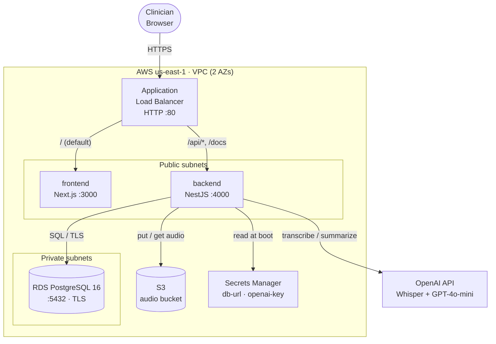
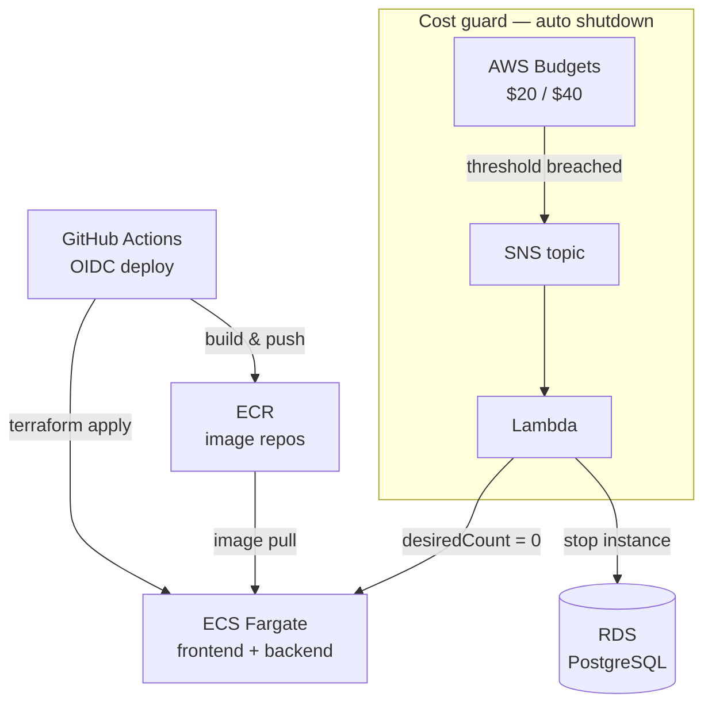
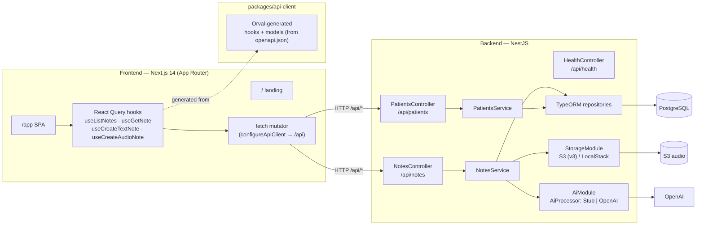
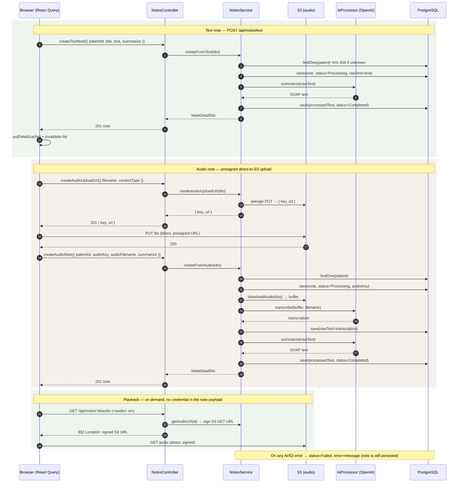
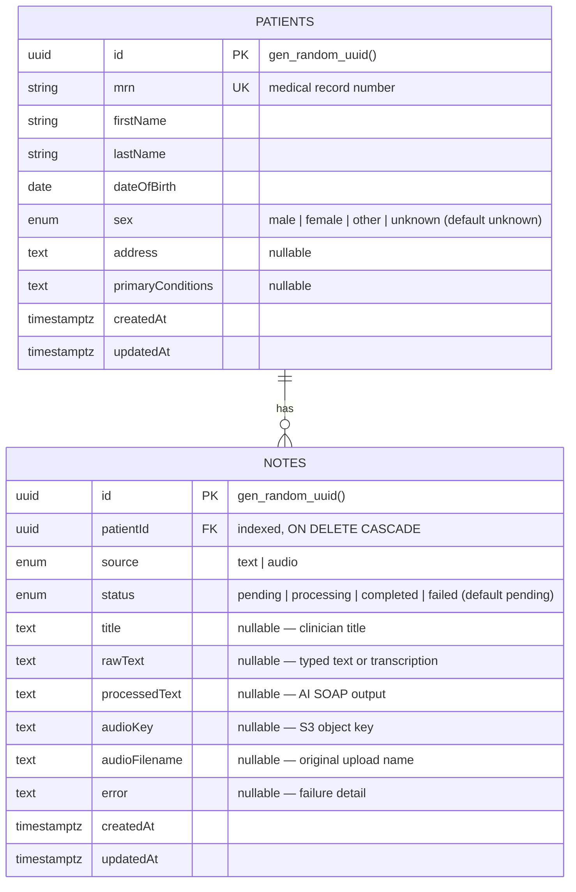
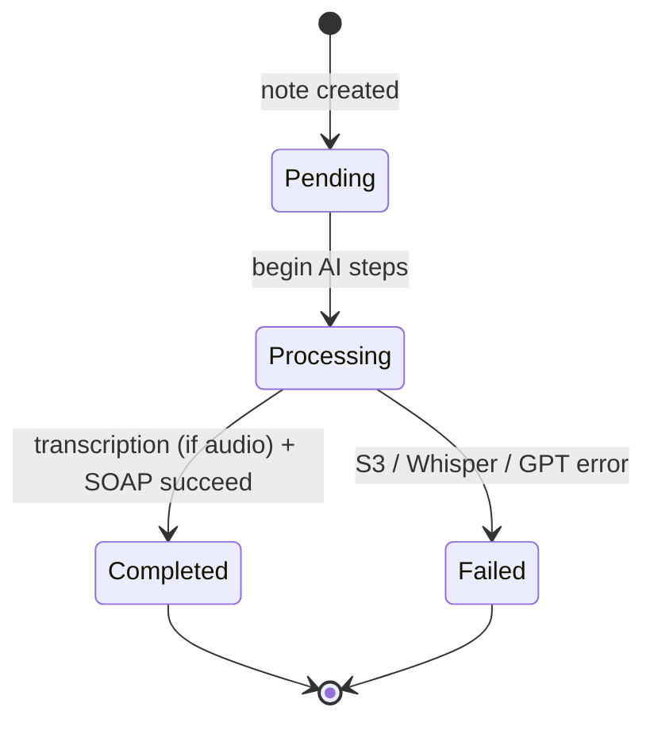

# ScrAI — Architecture & Data Model

AI clinical-scribe tool: turns typed text or recorded audio from a home visit into a
structured SOAP note. This document captures the system architecture, request/data
flow, the note-processing pipeline, and the database schema.

All diagrams below are [Mermaid](https://mermaid.js.org/) and render natively on GitHub.

- [1. System architecture (AWS)](#1-system-architecture-aws)
- [2. Application components & data flow](#2-application-components--data-flow)
- [3. Note-processing pipeline (sequence)](#3-note-processing-pipeline-sequence)
- [4. Database schema (ER)](#4-database-schema-er)
- [5. Note lifecycle (state)](#5-note-lifecycle-state)

---

## 1. System architecture (AWS)

Single ALB fronts two ECS Fargate services (Next.js frontend, NestJS backend) with
path-based routing. To keep the demo cheap there is **no NAT gateway** — tasks run in
public subnets with a public IP for outbound (ECR pulls, OpenAI). RDS stays private.

It's easier to read as two views: the **runtime request path**, and the
**operations** plane (how images ship and how spend is capped).

**Runtime topology** — request path and data stores:

**Operations** — deploy pipeline and the automatic cost guard:

**Routing (ALB listener rules).**

| Priority | Path patterns              | Target service      | Health check |
|----------|----------------------------|---------------------|--------------|
| 10       | `/api/*`, `/docs`, `/docs/*` | backend (:4000)     | `/api/health` |
| 100      | `/` (default)              | frontend (:3000)    | `/`          |

The browser calls the backend **same-origin** at `/api` (so no CORS in prod); the ALB
routes `/api/*` to the backend. During SSR the frontend reaches the backend via the
internal ALB DNS (`API_BASE_URL_INTERNAL`).

**Security groups.** ALB accepts `:80` from the internet → ECS `service` SG accepts all
TCP from the ALB SG only → RDS SG accepts `:5432` from the `service` SG only.

**Secrets.** `DATABASE_URL` and `OPENAI_API_KEY` live in Secrets Manager and are injected
into the backend container by the ECS execution role; the backend task role additionally
grants S3 access to the audio bucket.

---

## 2. Application components & data flow

Monorepo (pnpm workspaces): a Next.js SPA + marketing landing, a shared generated API
client (Orval → TanStack React Query hooks), and a NestJS backend with feature modules.

**API surface** (all under the `/api` global prefix; Swagger at `/docs`):

| Method | Route              | Purpose                                   |
|--------|--------------------|-------------------------------------------|
| GET    | `/api/health`      | Liveness probe                            |
| GET    | `/api/patients`    | List patients                             |
| GET    | `/api/patients/:id`| Get one patient                           |
| POST   | `/api/patients`    | Create patient                            |
| GET    | `/api/notes`               | List notes (with patient summary)           |
| GET    | `/api/notes/:id`           | Note detail — pure cacheable data           |
| GET    | `/api/notes/:id/audio`     | 302-redirect to a signed S3 URL for playback|
| POST   | `/api/notes/text`          | Create note from typed text                 |
| POST   | `/api/notes/audio/upload-url` | Presigned S3 PUT URL for direct upload   |
| POST   | `/api/notes/audio`         | Create note from an already-uploaded object |

The `AiProcessor` interface has two implementations selected by `AI_PROVIDER`:
`StubProcessor` (deterministic, no external calls) and `OpenAiProcessor`
(Whisper `whisper-1` for transcription + `gpt-4o-mini` for SOAP structuring).

---

## 3. Note-processing pipeline (sequence)

Both entry points create the note in `processing` state, run the AI steps synchronously,
then persist `completed` or `failed`. Text skips transcription; audio adds an S3 upload
and a Whisper pass first.

---

## 4. Database schema (ER)

Two tables. A patient has many notes; a note belongs to exactly one patient
(`patientId` FK, indexed, `ON DELETE CASCADE`). Schema is managed by TypeORM
(`DATABASE_SYNCHRONIZE=true` in this demo — no migration files).

**Enum reference**

| Table    | Column   | Values                                          |
|----------|----------|-------------------------------------------------|
| patients | `sex`    | `male`, `female`, `other`, `unknown` (default)  |
| notes    | `source` | `text`, `audio`                                 |
| notes    | `status` | `pending`, `processing`, `completed`, `failed`  |

---

## 5. Note lifecycle (state)

> In the current implementation the note is written directly as `Processing` on create
> (the `Pending` default exists on the entity for an async-queue variant). Processing runs
> inline within the request; a production build would move it to a background worker.
