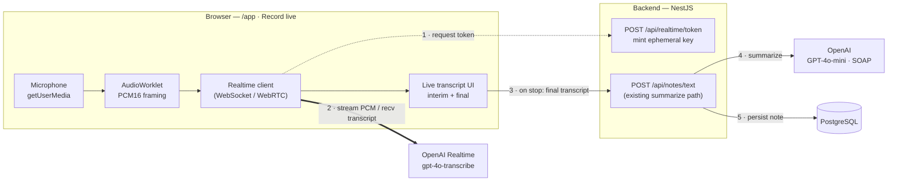
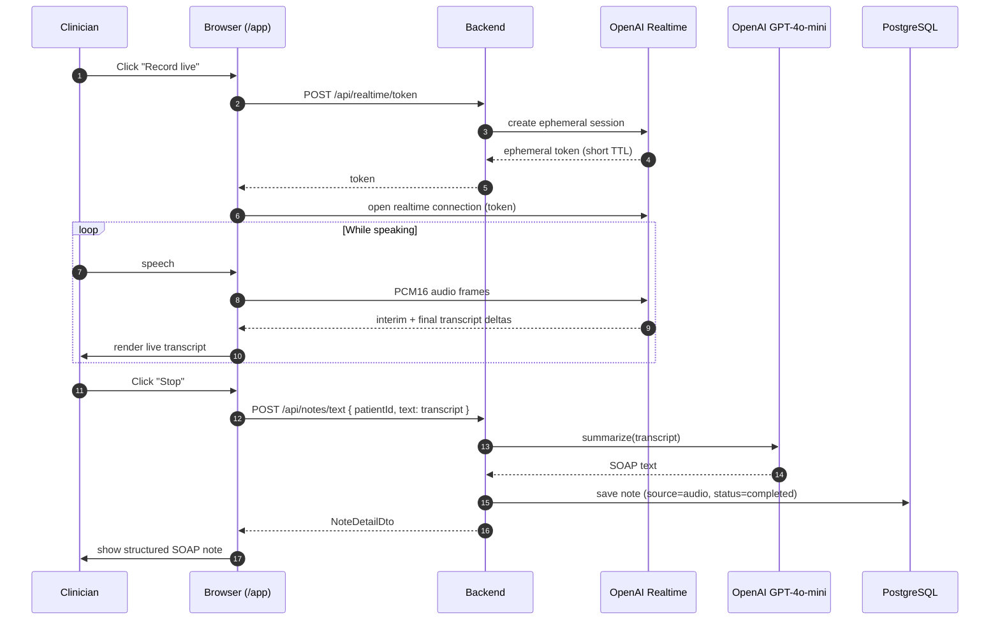

# Live Transcription — Architecture & Design Proposal

> **Status:** Proposal — not yet implemented.
> **Scope:** Add a real-time "Record live" mode to the note composer so a clinician's
> speech is transcribed on screen as they talk, then structured into a SOAP note using
> the **existing** AI pipeline.

Related: the batch (upload-a-file) flow and system context live in
[`architecture.md`](architecture.md).

- [1. Goal & why it's cheap to add](#1-goal--why-its-cheap-to-add)
- [2. Recommended approach](#2-recommended-approach)
- [3. Component architecture](#3-component-architecture)
- [4. Live session sequence](#4-live-session-sequence)
- [5. Reusing the existing pipeline](#5-reusing-the-existing-pipeline)
- [6. Changes required](#6-changes-required)
- [7. Data model & persistence](#7-data-model--persistence)
- [8. Security & PHI](#8-security--phi)
- [9. Alternatives considered](#9-alternatives-considered)
- [10. Effort & phasing](#10-effort--phasing)
- [11. Open questions & risks](#11-open-questions--risks)

---

## 1. Goal & why it's cheap to add

Today a note is produced in two decoupled steps:

```
transcribe(audio) ──▶ summarize(rawText) ──▶ SOAP note
```

The expensive, already-built half is `summarize(...) → SOAP` plus persistence, and there
is already a **"Type text" → note** path that takes a raw string straight to SOAP. Live
transcription only changes **how we obtain `rawText`**: instead of uploading a file and
calling Whisper in batch, we stream the mic to a real-time speech-to-text service and
accumulate the transcript live. When the clinician stops, the final transcript feeds the
**unchanged** summarize + persist path.

So the new work is concentrated in one area — **browser audio capture + streaming
transport** — not in the note/AI/data layers.

---

## 2. Recommended approach

**OpenAI Realtime transcription (`gpt-4o-transcribe`) with a server-minted ephemeral
token.** Rationale:

- **Stays on the existing vendor** — no second BAA, no new provider abstraction; reuses
  the OpenAI key already in Secrets Manager.
- **The API key never reaches the browser.** The backend mints a short-TTL *ephemeral
  token*; the browser opens the realtime connection directly to OpenAI with that token.
- **No WebSocket server in our infrastructure.** Because the browser talks to OpenAI
  directly, our backend stays request/response — no long-lived socket to run on Fargate,
  no ALB idle-timeout tuning, no audio proxying through our compute.

The only server addition is one small endpoint that mints the token.

---

## 3. Component architecture



---

## 4. Live session sequence



---

## 5. Reusing the existing pipeline

| Layer                         | Change for live mode                                    |
|-------------------------------|---------------------------------------------------------|
| `AiProcessor.summarize()`     | **None** — reused as-is                                 |
| `NotesService` persist path   | **None** — the final transcript goes through `/api/notes/text` |
| `NoteDetailDto` / DB schema   | **None** required (see §7)                               |
| React Query hooks + cache     | **None** — `useCreateTextNote` already exists            |
| AI provider abstraction       | Extend with a small realtime-token helper only          |

The live transcript is just text — dropping it into the existing "Type text" mutation
means the note appears, invalidates the list, and structures into SOAP exactly like a
typed note does today.

---

## 6. Changes required

**Backend (small):**
- `POST /api/realtime/token` — calls OpenAI to create an ephemeral realtime session and
  returns the short-lived client token. Guard behind the same auth as the rest of `/api`.
- Add the realtime call to `OpenAiProcessor` (or a sibling helper) so the stub provider
  can return a fake token for local/CI without network.

**Frontend (the bulk of the work):**
- `getUserMedia` mic capture + an **`AudioWorklet`** to emit PCM16 frames at the sample
  rate the model expects (the fiddliest piece).
- A realtime client (WebSocket or WebRTC) that streams frames and receives interim/final
  transcript deltas.
- A third composer mode — **"Record live"** — alongside *Upload audio* and *Type text*,
  with start / pause / stop controls and an interim-vs-final transcript display.
- On stop: hand the accumulated transcript to the existing `useCreateTextNote` mutation.

**Infra:** none for the recommended (ephemeral-token) design. The ALB already supports
WebSockets should we ever switch to proxying audio server-side (not needed here).

---

## 7. Data model & persistence

No schema change is required. Recommended mapping for a live note:

- `source = audio` (it originated from speech), `rawText = <final transcript>`,
  `processedText = <SOAP>`, `status = completed`.
- `audioKey` optional: if we also capture the raw audio locally and upload it to S3 on
  stop, store the key here; otherwise leave it null.

If we want live notes to be *visually distinguishable* from uploaded-file notes, add a
`live` value to the `NoteSource` enum — a one-line entity change (and, with
`DATABASE_SYNCHRONIZE=true` in this demo, no manual migration). Not required for v1.

---

## 8. Security & PHI

- **Key isolation:** the OpenAI key stays server-side; the browser only ever holds a
  short-TTL ephemeral token scoped to one session.
- **PHI boundary is unchanged from today** — audio/transcripts already go to OpenAI in
  the batch flow; live streaming sends the same data continuously rather than in one
  upload. Whatever BAA / data-processing terms cover the current OpenAI usage cover this.
- **Transport:** realtime connection is TLS (wss). Prefer ephemeral tokens over ever
  embedding a long-lived key in client code.
- **Retention:** decide whether to persist the raw audio (S3) or only the transcript.
  Transcript-only is the smaller PHI footprint.

---

## 9. Alternatives considered

| Approach | Effort | PHI posture | Quality | Notes |
|----------|--------|-------------|---------|-------|
| **OpenAI Realtime** (recommended) | 2–3 days | Same vendor as today | High | No WS server needed; reuses OpenAI key |
| Browser Web Speech API | ~0.5 day | ✗ ships audio to Google | Medium, Chrome-biased | Great for a UX spike; **not** for clinical PHI |
| Deepgram / AssemblyAI streaming | 2–3 days | New vendor + BAA | High | Smoothest streaming API; adds a dependency |
| Chunked Whisper batch (record → POST short clips) | 1–2 days | Same as today | Poor — choppy, cut words | "Poor man's live"; avoid |

---

## 10. Effort & phasing

**Realistic total: 2–3 focused days** — the architecture already did the expensive part
(SOAP structuring + provider abstraction + a text→note path).

| Phase | Work | Est. |
|-------|------|------|
| 0 | *(optional)* Web Speech spike to validate the composer UX | 0.5 day |
| 1 | Backend ephemeral-token endpoint + stub-provider fake | 2–3 hrs |
| 2 | Mic capture + AudioWorklet PCM framing | ~1 day |
| 3 | Realtime client + "Record live" composer mode + interim UI | ~1 day |
| 4 | Wire final transcript → `useCreateTextNote`; polish, error/reconnect states | 0.5 day |

Risk is concentrated in **Phase 2** (browser audio); everything else is small or reused.

---

## 11. Open questions & risks

- **Model choice:** `gpt-4o-transcribe` vs `gpt-4o-mini-transcribe` — trade accuracy vs
  cost/latency; confirm streaming-transcription support and audio format at build time.
- **Reconnect/UX:** dropped-socket handling mid-visit; partial transcript recovery.
- **Persist audio?** transcript-only (smaller PHI footprint) vs also archiving to S3.
- **Speaker labels:** single-mic home visit likely doesn't need diarization; revisit if
  two-party capture is wanted.
- **Cost:** realtime transcription is billed per audio minute — worth a quick estimate
  against expected visit volume before committing.
